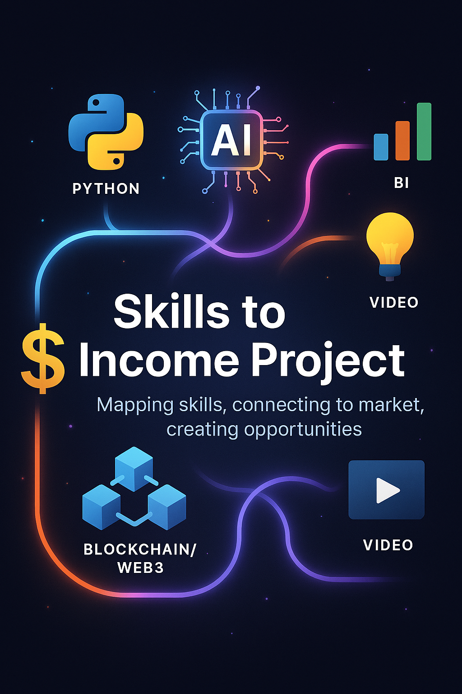

# Habilidades-que-Geram-Renda

# 🧭 Identificando minhas Habilidades que Podem ser Remuneradas

Este projeto ajuda a **mapear suas habilidades pessoais** e cruzá-las com as **necessidades do mercado**, mostrando caminhos de monetização possíveis.  
A proposta é usar **inteligência artificial** e ferramentas digitais para transformar talentos em oportunidades reais de trabalho ou renda.

---



---

## 📊 Etapas do Projeto 

### 🔹 Etapa 1: Inventário de Habilidades 
Liste tudo o que você sabe fazer.  
Perguntas que ajudam:
- O que as pessoas costumam elogiar em você?
- Em que tarefas você se sente confiante?
- Que tipo de ajuda você costuma oferecer?
- Quais atividades você faz com facilidade?

💡 **IA pode ajudar:** usar Copilot ou outras IAs para sugerir habilidades com base em currículo, LinkedIn ou interesses.  
👉 Veja o arquivo [`etapa1-inventario.md`](etapa1-inventario.md).

---

### 🔹 Etapa 2: Cruzamento com Necessidades do Mercado 
Analise cada habilidade e pergunte:
- Existe demanda por isso?
- Alguém pagaria por isso?
- Resolve um problema comum?

💡 **IA pode ajudar:** perguntar sobre tendências no Google Trends, LinkedIn Insights ou pedir ideias de monetização.  
👉 Veja o arquivo [`etapa2-mercado.md`](etapa2-mercado.md).

---

### 🔹 Etapa 3: Caminhos de Monetização 
Checklist:
1. Oferecer serviços em plataformas (Workana, Fiverr, 99Freelas, GetNinjas)  
2. Criar conteúdo gratuito para atrair clientes (Instagram, TikTok, YouTube)  
3. Montar portfólio simples (GitHub, LinkedIn)  
4. Fazer parcerias locais  
5. Dar aulas ou mentorias  

💡 **IA pode ajudar:** gerar textos para redes sociais, propostas comerciais, nomes de serviços e planos de conteúdo.  
👉 Veja o arquivo [`etapa3-monetizacao.md`](etapa3-monetizacao.md).

---

## 📂 Estrutura do Repositório 

```bash
📦 Skills-to-Income-Project/
├── README.md
├── etapa1-inventario.md
├── etapa2-mercado.md
├── etapa3-monetizacao.md
└── assets/
    └── capa-projeto.png
```

---

## ✅ Entrega
1. Preencher o Mapa de Habilidades com as 3 etapas.  
2. Subir no GitHub pessoal.  
3. Compartilhar o link na plataforma da DIO.

---

## 🌍 Extras
- **Blockchain & Web3:** explorar monetização com smart contracts e DApps.  
- **Edição de vídeos:** criar conteúdo digital para atrair clientes.  
- **Inglês:** acessar documentação internacional e ampliar alcance global.  

  
---
## ✨ Autor
**Ronaldo** — Estudante de Engenharia de Software, com experiência em Python, IA, BI e Blockchain, entre outros...
---

## 🔚 Conclusão 

Este projeto demonstra como qualquer pessoa pode transformar suas habilidades em oportunidades reais de renda.  
Ao seguir as três etapas — inventário de habilidades, cruzamento com necessidades do mercado e caminhos de monetização — é possível criar um mapa claro para desenvolver um portfólio, oferecer serviços e explorar novas formas de trabalho.  

Mais do que um exercício acadêmico, este repositório é uma ferramenta prática para quem deseja alinhar **talento, tecnologia e mercado**.  
O próximo passo é aplicar esse método às suas próprias habilidades e começar a construir sua jornada de crescimento profissional.

